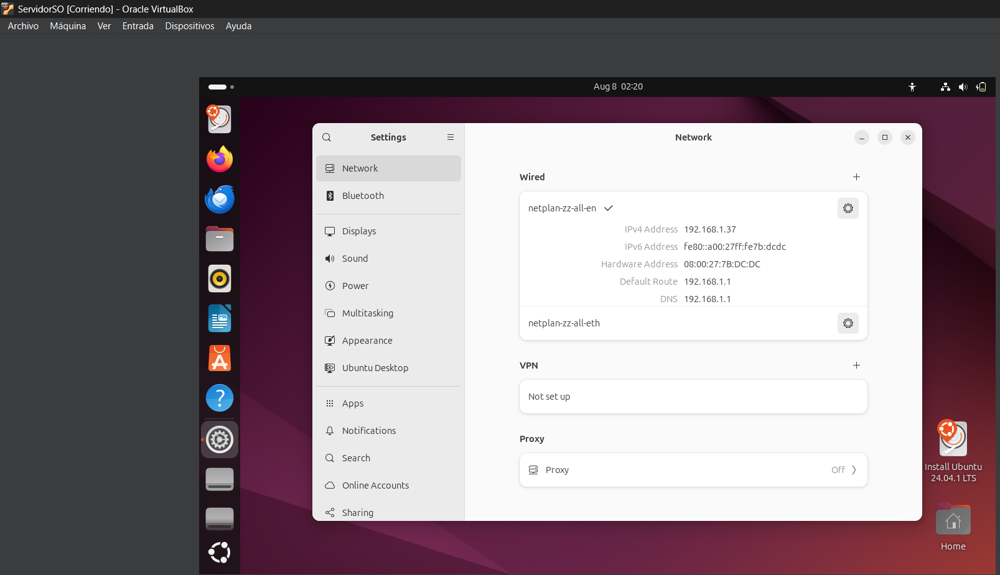

# Instalacion del sistema operativo 

##Sistema operativo
-Distribucion> Ubuntu Desktop 24.04.1 LTS
-Metodo de instalacion> instalacion desatendida (Unattended install) mediante VirtualBox 7

## ESpesificaciones de la maquina virtual
-Nombre de la VM: ServidorSO
-Memoria RAM: 2048 MB
-Almacenamiento: 25 GB (Controlador SATA, disco dinamico)
-Adaptador de red: Adaptador puente (bridged)- Intel PRO/1000 MT Desktop

##Configuracion inicial
-Usuario generad por la instalacion: vboxuser 
-Contraseña inicial por defecto (changeme) reemplazada por una propia tras el primer ingreso 
-Actualizacion del sistema ejecutada con `sudo apt update && sudo apt upgrate -y`
-Direccion IP asignada verificada con `ip a` :192.168.1.37/24

## Opservaciones
-Durante la instalacion se presento lentitud debido al uso elevado de RAM del equipo anfitrion, se libero memoria cerrando aplicaciones en segundo plano 
- Se confirmo conectividad de red antes de continuar con la configuracion del servidor web 

## Evidencias
 
          
