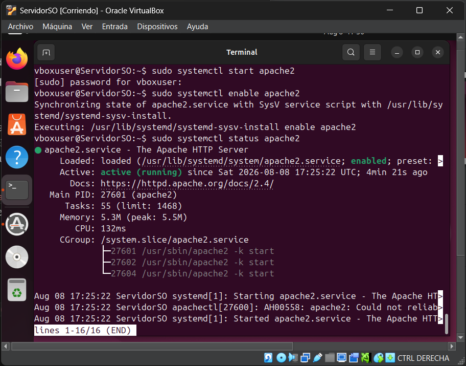
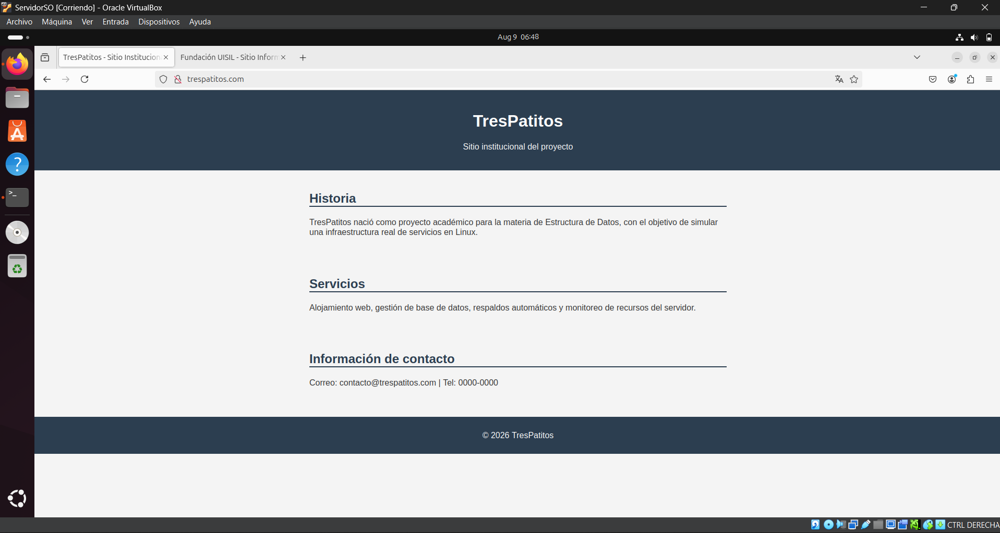
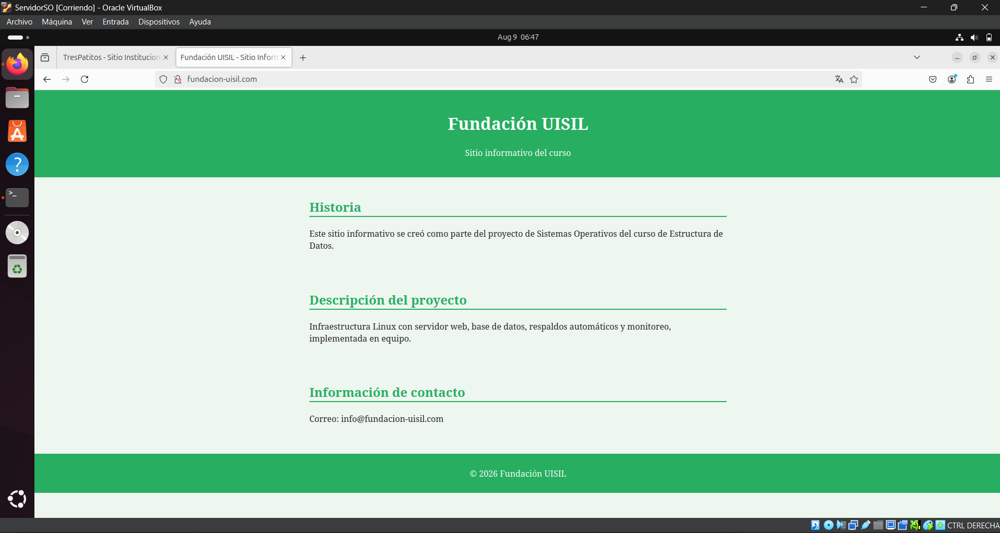
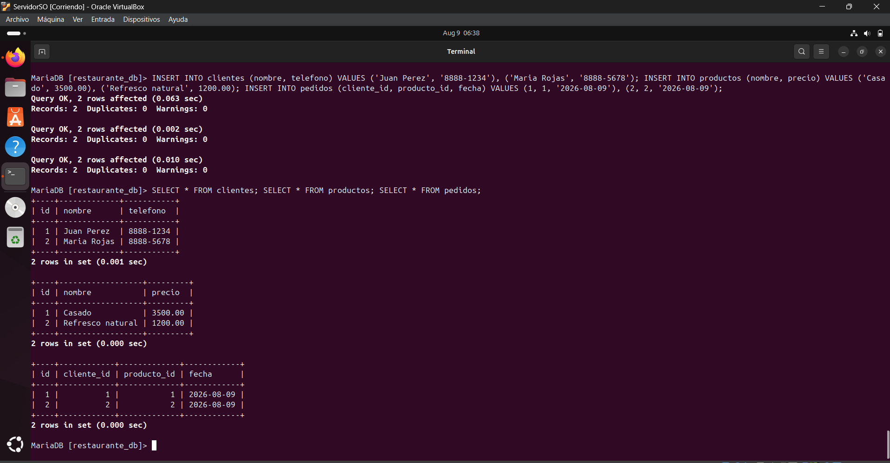

# Configuración del Servidor Web y Base de Datos

## Servidor web
- Software: Apache2
- Se crearon 2 Virtual Hosts, cada uno con su propio directorio en /var/www/
  - trespatitos.com → /var/www/trespatitos.com
  - fundacion-uisil.com → /var/www/fundacion-uisil.com
- Cada sitio contiene index.html con contenido informativo (Historia, Servicios, Contacto) y style.css con estilos básicos propios
- Se creó el archivo de configuración de cada dominio en /etc/apache2/sites-available/
- Se activaron con `sudo a2ensite` y se desactivó el sitio por defecto (000-default.conf) con `sudo a2dissite`
- Resolución de dominios: se agregó una entrada en /etc/hosts apuntando ambos dominios a 127.0.0.1, ya que no se cuenta con dominios reales
- Verificación: `sudo apache2ctl configtest` (Syntax OK) y prueba visual en el navegador con ambos dominios mostrando contenido distinto

## Base de datos
- Gestor: MariaDB
- Base de datos: restaurante_db
- Tablas creadas:
  1. clientes (id, nombre, telefono)
  2. productos (id, nombre, precio)
  3. pedidos (id, cliente_id, producto_id, fecha) — relacionada con clientes y productos mediante FOREIGN KEY
- Se insertaron registros de prueba en las 3 tablas y se verificaron con SELECT

## Evidencias

